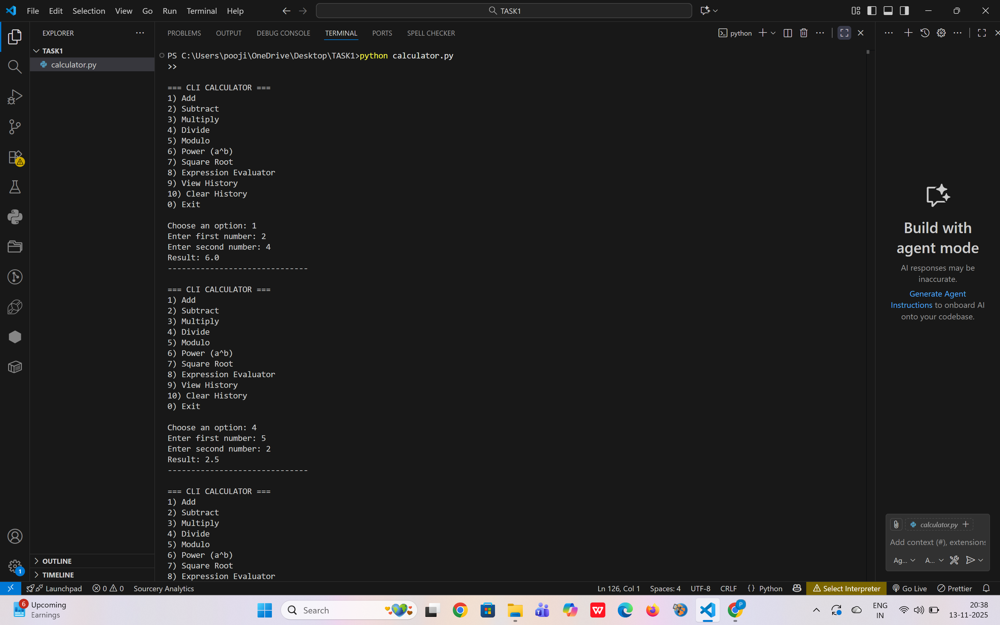

# CLI Calculator in Python

A simple and interactive command-line calculator built using Python.  
This project supports basic and advanced arithmetic operations with input validation and history tracking.

## ✨ Features
- Addition, Subtraction, Multiplication, Division  
- Modulo (%)
- Power (a^b)
- Square Root  
- Expression Evaluator (e.g., 5+7*2/3)
- Input validation
- Error handling (including division by zero)
- Calculation history
- Clear history option
- Clean text-based menu

## 🛠️ Tech Stack
- Python 3.x

## ▶️ Run the Program

python3 calculator.py

## 📸 Output Screenshot

Below is the output of running the CLI Calculator:

